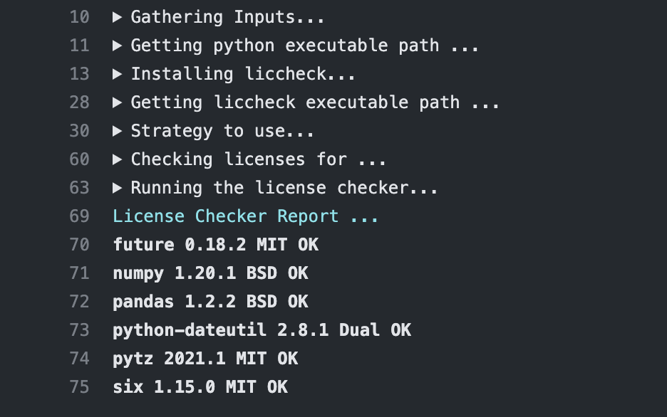
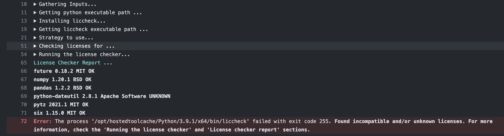

# `andersy005/gh-action-py-liccheck`

- [`andersy005/gh-action-py-liccheck`](#andersy005gh-action-py-liccheck)
  - [Usage](#usage)
    - [Basic](#basic)
    - [With custom locations for strategy and requirements files](#with-custom-locations-for-strategy-and-requirements-files)
  - [GitHub action outcomes](#github-action-outcomes)
  - [Arguments](#arguments)
  - [How `liccheck` works](#how-liccheck-works)
  - [Example strategy files](#example-strategy-files)
  - [Contributing](#contributing)
  - [License](#license)

This GitHub action checks license of Python packages and their dependencies via the [liccheck](https://github.com/dhatim/python-license-check) package.

## Usage

To integrate this action with your action pipelines, add the following step to your workflow file (e.g. `.github/workflows/ci.yml`).

### Basic

The basic usage uses the default values defined in table below. Therefore, as a user you don't have to specify any argument:

```yaml
- name: License Checker
  uses: andersy005/gh-action-py-liccheck@main
```

### With custom locations for strategy and requirements files

```yaml
- name: License Checker
  uses: andersy005/gh-action-py-liccheck@main
  with:
    strategy-ini-file: ./my-strategy.ini
    level: standard
    requirements-txt-file: ./my-requirements.txt
    no-deps: true
```

## GitHub action outcomes

Once this action finishes running, it reports the status of compliance of packages. Depending on your settings (strategy, level, etc), you should see something of this sort in your workflow's logs:

<details>
<summary>Outcome 1 - Success</summary>



</details>

<details>
<summary>Outcome 2 - Failure</summary>



</details>

## Arguments

This action currently supports four inputs from the user: `strategy-ini-file`, `level`, `requirements-txt-file`, and `no-deps`.

These inputs, along with their descriptions and usage contexts, are listed in the table below:

|          Input          |                                                                                                  Description                                                                                                   |  Usage   |      Default       |
| :---------------------: | :------------------------------------------------------------------------------------------------------------------------------------------------------------------------------------------------------------: | :------: | :----------------: |
|   `strategy-ini-file`   |                                                  Path to a strategy ini file or a pyproject.toml file to use. See [examples](#example-strategy-files) below.                                                   | Optional |  `pyproject.toml`  |
| `requirements-txt-file` |                                                                                    Path to a requirements.txt file to use.                                                                                     | Optional | `requirements.txt` |
|        `no-deps`        |                                                                                     Whether **not** to check dependencies.                                                                                     | Optional |      `false`       |
|         `level`         | Level for testing compliance of packages, where: `standard` - At least one authorized license (default); `cautious` - Per standard but no unauthorized licenses; `paranoid` - All licenses must be authorized. | Optional |     `standard`     |

## How `liccheck` works

`liccheck` verifies compliance of packages defined in a `requirements.txt` file against a strategy defined in either a `pyproject.toml` or `.ini` file. To use this GitHub action, you have to define the following three items in your strategy file:

- authorized license list
- unauthorized license list
- authorized package list (optional)

**NOTE:** The packages from your `requirements.txt` need to all be installed in a Python environment prior to using this GitHub action.

## Example strategy files

Here are some examples showcasing how to define a strategy in both `pyproject.toml` and `.ini` files:

<details>
<summary>Example pyproject.toml</summary>

```toml
[tool.liccheck]
# Authorized and unauthorized licenses in LOWER CASE
authorized_licenses = [
        "bsd",
        "new bsd",
        "bsd license",
        "new bsd license",
        "simplified bsd",
        "apache",
        "apache 2.0",
        "apache software license",
        "apache software",
        "gnu lgpl",
        "lgpl with exceptions or zpl",
        "isc license",
        "isc license (iscl)",
        "mit",
        "mit license",
        "python software foundation license",
        "zpl 2.1"
]

unauthorized_licenses = [
        "gpl v3"
]

[tool.liccheck.authorized_packages]
uuid = "<=1.30"
```

</details>

<details>
<summary>Example strategy.ini</summary>

```ini
# Authorized and unauthorized licenses in LOWER CASE
[Licenses]
authorized_licenses:
        bsd
        new bsd
        bsd license
        new bsd license
        simplified bsd
        apache
        apache 2.0
        apache software license
        apache software
        gnu lgpl
        lgpl with exceptions or zpl
        isc license
        isc license (iscl)
        mit
        mit license
        python software foundation license
        zpl 2.1

unauthorized_licenses:
        gpl v3

[Authorized Packages]
uuid: 1.30

```

</details>

## Contributing

Contributions are welcome!

## License

The code and documentation in this project are released under the
[MIT License](LICENSE).
